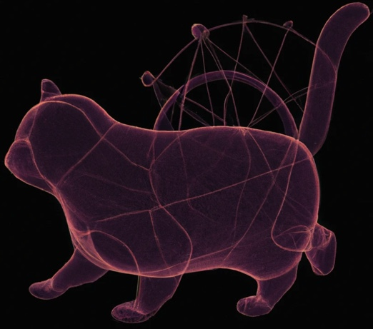

# Adaptive Categorical Discretization (AdaCat)

## AdaCat from DALL E


## News (08/04/2022)
We have a pip-installable package for PyTorch users ([Colab demo](https://colab.research.google.com/drive/1dVOJpiJLXtAK_O68Tt4995dYU5BU-1S0?usp=sharing)) and JAX distrax ([Colab demo](https://colab.research.google.com/drive/14KPbk9MUqG3TyOySuZ-vK_fg9Kkld6Bs?usp=sharing)) users! [Website](https://colinqiyangli.github.io/adacat/)


## What is in this Repo
Code for reproducing the experiments in [AdaCat: Adaptive Categorical Discretization for Autoregressive Models](https://arxiv.org/abs/2208.02246). The codebase is organized as a collections of four different smaller codebases:
- `mnist/` -- image generation for MNIST dataset (Figure 4 and Table 2)
- `tabular/` -- generative modeling on UCI datasets (Table 1)
- `tto/` -- offline reinforcement learning on mujoco locomotion tasks (Table 4)
- `wavenet/` -- audio generation on LJSpeech dataset (Table 3)

Please refer to the `README.md` under each folder for commands that reproduce the experiments in the paper.

## Common Setup Steps 
Tested with `torch==1.11.0`, `torchvision==0.12.0`

```
apt-get install --no-install-recommends ffmpeg
```

```
conda create -n adacat python=3.7
conda activate adacat

pip install torch torchvision wandb numpy pandas h5py torch_ema==0.3 tqdm typed-argument-parser matplotlib ffmpeg scikit-video
pip install git+https://github.com/rail-berkeley/d4rl@master#egg=d4rl

cd tto && pip install -e . 
```

## Citation
The bibtex is provided below for citation covenience.
```
@inproceedings{
li2022adacat,
title={AdaCat: Adaptive Categorical Discretization for Autoregressive Models},
author={Qiyang Li and Ajay Jain and Pieter Abbeel},
booktitle={The 38th Conference on Uncertainty in Artificial Intelligence},
year={2022},
url={https://openreview.net/forum?id=HMzzPOLs9l5}
}
```

## Acknowledgements
The codebase is built on top of multiple publicly available repos:
- Michael Janner's [trajectory_transformer](https://github.com/jannerm/trajectory-transformer).
- Andrej Karpathy's [minGPT](https://github.com/karpathy/minGPT).
- Truncated Normal Distribution: https://github.com/toshas/torch_truncnorm

